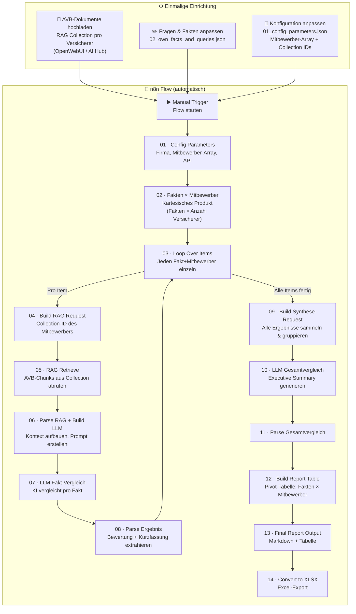

# AI_Document_Compare

Generischer n8n-Flow zum Vergleich von Versicherungsbedingungen (AVB) gegen **mehrere** Mitbewerber-Dokumente via RAG (Retrieval Augmented Generation).

## Überblick

Dieses Repository enthält einen n8n-Workflow, der **Hard Facts** aus eigenen Versicherungsprodukten systematisch gegen Mitbewerber-Dokumente prüft. Der Prozess ist **generisch** aufgebaut und unterstützt gleichzeitig **beliebig viele Versicherer** – jeder mit seiner eigenen RAG-Collection.

### Ergebnis

Am Ende des Flows wird eine **Report-Tabelle** mit dynamischen Spalten erzeugt (eine Spalte pro Mitbewerber):

| Nr | Kategorie | Aspekt | HMR (eigen) | ERV (RAG) | ERV Bewertung | ALZ (RAG) | ALZ Bewertung |
|----|-----------|--------|-------------|-----------|---------------|-----------|---------------|

Zusätzlich wird eine **Executive Summary** mit Gesamtbewertung, Vor-/Nachteilen und Handlungsempfehlungen für alle Mitbewerber generiert.

---

## Ablaufplan



### Prozessbeschreibung

1. **Dokumente einlesen (RAG-Setup):** Die AVB-Dokumente jedes Versicherers werden einmalig als separate Collection im RAG-System (OpenWebUI/AI Hub) hochgeladen.
2. **Konfiguration:** In `01_config_parameters.json` werden die eigene Firma und alle Mitbewerber mit ihren Collection-IDs eingetragen. Neue Versicherer einfach als weiteres Objekt zum `COMPETITORS`-Array hinzufügen.
3. **Fragen anpassen:** In `02_own_facts_and_queries.json` werden die zu vergleichenden Fakten (Hard Facts) und die RAG-Fragen gepflegt. Der Flow generiert automatisch für **jeden Fakt und jeden Mitbewerber** ein Item (kartesisches Produkt).
4. **Verarbeitungsschleife:** Für jedes Item (Fakt × Mitbewerber) werden die relevanten AVB-Chunks per RAG abgerufen und vom LLM verglichen.
5. **Report-Generierung:** Alle Ergebnisse werden zu einer Pivot-Tabelle und einer Executive Summary zusammengeführt.

---

## RAG-Setup: Dokumente einlesen

Jeder Versicherer benötigt eine eigene Collection im RAG-System (z. B. OpenWebUI). So geht's:

### Schritt 1: Collection anlegen

1. OpenWebUI öffnen → **Workspace → Knowledge**
2. **Neue Collection** erstellen, z. B. `ERV-Seminarversicherung`
3. AVB-Dokumente (PDF, TXT, DOCX) in die Collection hochladen
4. Die **Collection-ID** notieren (UUID in der URL, z. B. `32c26a09-6c8c-449c-a060-1146f20c0322`)

> **Wichtig:** Eine Collection pro Versicherer anlegen. So kann der Flow gezielt die richtigen Dokumente abfragen.

### Schritt 2: Collection-ID in die Konfiguration eintragen

In `comparison_flow/nodes/01_config_parameters.json` die Collection-ID im `COMPETITORS`-Array hinterlegen (siehe Abschnitt "Konfiguration anpassen" unten).

---

## Projektstruktur

```
├── n8n_Flow.json                          # Originaler spezifischer Flow (HMR vs ERV)
├── comparison_flow/
│   ├── nodes/                             # Einzelne Node-Dateien
│   │   ├── 00_manual_trigger.json         # Manueller Start-Trigger
│   │   ├── 01_config_parameters.json      # Konfiguration (Firma, Mitbewerber-Array, API)
│   │   ├── 02_own_facts_and_queries.json  # Eigene Hard Facts + RAG-Queries (buildFacts-Funktion)
│   │   ├── 03_loop_over_items.json        # Schleife über alle Fakt-Mitbewerber-Kombinationen
│   │   ├── 04_build_rag_request.json      # RAG-Request mit Collection-ID des Mitbewerbers
│   │   ├── 05_rag_retrieve.json           # RAG-Abfrage an Mitbewerber-Collection
│   │   ├── 06_parse_rag_build_llm_request.json  # RAG parsen + LLM-Vergleich bauen
│   │   ├── 07_llm_fact_comparison.json    # LLM-Vergleich pro Fakt
│   │   ├── 08_parse_comparison_result.json # Vergleichsergebnis parsen (inkl. Mitbewerber-Felder)
│   │   ├── 09_build_synthesis_request.json # Gesamtvergleich-Request (gruppiert nach Mitbewerber)
│   │   ├── 10_llm_overall_comparison.json  # LLM-Gesamtvergleich
│   │   ├── 11_parse_overall_comparison.json # Gesamtvergleich parsen
│   │   ├── 12_build_report_table.json     # Pivot-Tabelle: Fakten × Mitbewerber
│   │   ├── 13_final_report_output.json    # Finaler Report (dynamische Spalten)
│   │   └── 14_convert_to_xlsx.json        # Excel-Export
│   ├── connections.json                   # Node-Verbindungen
│   ├── flow_metadata.json                 # Flow-Metadaten (Name, Tags, Settings)
│   ├── assemble_flow.js                   # Script zum Assemblieren des Flows
│   └── assembled_flow.json               # Assemblierter, importierbarer Flow
```

---

## Konfiguration anpassen

### Schritt 1: Mitbewerber konfigurieren

In `comparison_flow/nodes/01_config_parameters.json` das `COMPETITORS`-Array anpassen. Jeder Versicherer braucht einen Eintrag mit seiner RAG-Collection-ID:

```javascript
// --- Eigene Firma ---
const OWN_COMPANY_NAME = 'HanseMerkur';
const OWN_COMPANY_SHORT = 'HMR';
const OWN_PRODUCT_NAME = 'Seminar-Ruecktrittsversicherung';

// --- Mitbewerber (Array - beliebig viele Versicherer) ---
const COMPETITORS = [
  {
    name: 'ERGO Reiseversicherung',
    short: 'ERV',
    productName: 'Seminar-Versicherung',
    ragCollection: '32c26a09-6c8c-449c-a060-1146f20c0322'  // <-- Collection-ID aus RAG-System
  },
  // Weiteren Versicherer einfach hinzufügen:
  {
    name: 'Allianz Travel',
    short: 'ALZ',
    productName: 'Seminar-Schutz',
    ragCollection: 'xxxxxxxx-xxxx-xxxx-xxxx-xxxxxxxxxxxx'  // <-- Collection-ID aus RAG-System
  },
];
```

> Jeder Eintrag im Array erzeugt automatisch eine eigene Spalte im Report.

### Schritt 2: Fragen anpassen (optional)

In `comparison_flow/nodes/02_own_facts_and_queries.json` die `buildFacts(comp)`-Funktion anpassen. Jeder Fakt hat folgende Struktur:

```javascript
{
  id: 1,
  kategorie: 'Produktuebersicht',
  aspekt: 'Produktname und Versicherungssparten',
  own_data: 'Eigene Regelung hier...',
  rag_query: `Wie heisst das Produkt der ${comp.name} fuer Seminare? ...`
  //                                    ^^^^^^^^^^
  //  comp.name wird automatisch für jeden Mitbewerber eingesetzt
}
```

> `comp` ist das aktuelle Mitbewerber-Objekt aus dem `COMPETITORS`-Array. Über `comp.name`, `comp.short` und `comp.productName` kann die Frage mitbewerber-spezifisch formuliert werden.

**Neue Frage hinzufügen:** Einfach einen weiteren Eintrag in das `return`-Array der `buildFacts`-Funktion einfügen. Die Frage wird automatisch für alle konfigurierten Mitbewerber gestellt.

### Schritt 3: Flow assemblieren

```bash
cd comparison_flow
node assemble_flow.js
```

### Schritt 4: In n8n importieren

Die Datei `comparison_flow/assembled_flow.json` in n8n importieren.

**Wichtig:** Die HTTP-Request-Nodes (05, 07, 10) verwenden n8n Credentials (`httpHeaderAuth`). Nach dem Import müssen die Credentials in n8n konfiguriert werden.

---

## Flow-Ablauf (Übersicht)

```
Manual Trigger
  → 01 Config Parameters       (Firma, Mitbewerber-Array, API-Einstellungen)
  → 02 Fakten × Mitbewerber    (kartesisches Produkt: N Fakten × M Versicherer = N×M Items)
  → 03 Loop Over Items
    ┌─→ 04 Build RAG Request    (Collection-ID des aktuellen Mitbewerbers)
    │   → 05 RAG Retrieve       (AVB-Chunks aus der Mitbewerber-Collection)
    │   → 06 Parse RAG + LLM    (Kontext aufbauen, Prompt erstellen)
    │   → 07 LLM Fakt-Vergleich (KI-Vergleich pro Fakt)
    │   → 08 Parse Ergebnis     (Bewertung + Kurzfassung + Mitbewerber-Felder)
    └─← (zurück zur Schleife)
  → 09 Build Synthese-Request   (alle N×M Ergebnisse sammeln, nach Mitbewerber gruppieren)
  → 10 LLM Gesamtvergleich      (Executive Summary für alle Mitbewerber)
  → 11 Parse Gesamtvergleich
  → 12 Build Report Table       (Pivot: Fakten als Zeilen, Mitbewerber als Spalten)
  → 13 Final Report Output      (Markdown-Report mit dynamischen Spalten)
  → 14 Convert to XLSX          (Excel-Export)
```

---

## Originaler Flow

Die Datei `n8n_Flow.json` enthält den ursprünglichen, spezifischen Flow für den Vergleich HanseMerkur vs. ERGO Seminarversicherung. Dieser dient als Referenz.